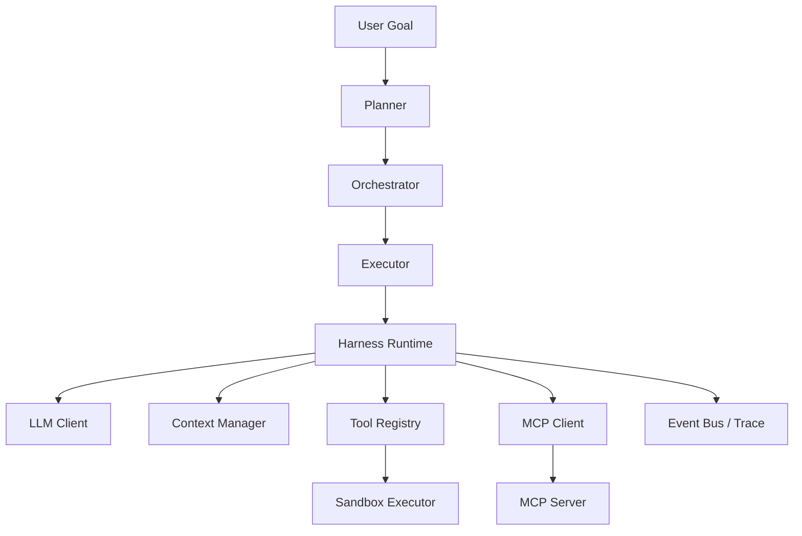

# Agent Harness｜轻量级工具型 Agent 执行框架

> Repository: `mini_harness`
>
> 一个面向 Agent Runtime / Agent Infra 学习、验证与面试展示的个人工程项目。

Mini Harness 从零实现了一个可运行的轻量级 Agent Harness：模型通过 ReAct 风格循环调用工具，运行时维护上下文和事件，MCP 适配层通过 stdio JSON-RPC 调用工具，多 Agent 层负责规划、执行和结果聚合。

项目重点不是封装业务工作流，而是验证 Agent 执行框架中的几个基础问题：工具调用协议如何闭环、上下文如何在预算内保持协议完整、工具边界如何限制、执行过程如何留下可追踪证据，以及多 Agent 编排如何与 Runtime 解耦。

## 当前状态

本项目处于持续稳定化阶段，不是生产级商业系统。

已完成并具有代码或测试证据的能力：

- 异步 Agent Loop：`LLM → tool_calls → tool result → LLM` 多轮执行。
- Tool Registry 与 Sandbox：工具注册、并发调用、超时、重试和工作区路径约束。
- Context Manager：完整消息 Token 计数、软/硬预算边界、异步摘要压缩和 Tool Calling Block 原子性保护。
- MCP：基于 stdio JSON-RPC 的 `initialize`、`tools/list`、`tools/call` 最小链路。
- Memory：LRU 长期记忆、JSON 持久化及上下文注入。
- Multi-Agent：Planner、Executor、Orchestrator、AgentScope 与 MessageBus。
- Event / Trace：记录模型请求、模型响应、工具调用、错误与完成事件，并导出 JSON Trace。
- 只读架构审计工具：文件读取白名单、目录遍历预算及结构化截断信息。

最近完成的安全边界修复：

- `e4f3454`：`read_file` 与 `list_directory` 统一应用审计白名单，越界路径在文件系统遍历前拒绝。
- `93ddc18`：目录遍历增加服务端硬限制：`MAX_DEPTH=2`、`MAX_ENTRIES=200`、`MAX_OUTPUT_TOKENS=2500`，并返回 `truncated`、`truncation_reasons` 和 `stats`。

最近完成的执行链路修复：

- E2E Compression 场景已补齐有效工具注册与上下文压力构造，Trace 可同时观察到 `compress_start` 和 `compress_done`。
- `6e7e4a8`：自我架构审计 Demo 将允许根统一注入 Tool Schema、Planner Context 和能力描述；真实 DeepSeek 运行能够主动扫描 `src/mini_harness` 与 `demo`，并读取核心源码作为审计证据。
- Runtime、LLM Client 与 MCP Client/Server 的临时 `print` 调试输出已替换为分级日志；这些组件的诊断日志只记录调用元数据，不记录提示词、工具参数值或模型响应原文。

当前已知限制：

- 真实 DeepSeek 长链路运行中仍可能出现 Tool Calling 协议不完整：一次 `assistant(tool_calls)` 后没有为全部 `tool_call_id` 保留对应的 `tool` 消息。该问题已与审计范围可发现性问题分离，后续将按独立缺陷处理。
- 当前审计报告由模型归纳生成，报告结论仍需结合 Trace 与源码证据人工复核；“脚本退出成功”不等同于“报告结论全部准确”。

## 架构概览



### 核心执行链

1. Runtime 将用户消息加入 Context。
2. LLM 返回最终文本或结构化 `tool_calls`。
3. Runtime 通过 Tool Registry 或 MCP 执行工具。
4. `assistant(tool_calls)` 与对应 `tool` 消息按协议写回 Context。
5. Runtime 继续下一轮，直至完成、报错或达到迭代上限。
6. EventBus 记录执行事实，Trace 导出运行时间线。

## 关键设计

### 1. Tool Calling 协议完整性

Context 将一次工具交互组织为不可拆分的 Message Block：

```text
assistant(tool_calls)
├── tool(tool_call_id=A)
└── tool(tool_call_id=B)
```

压缩和裁剪只允许在 Block 边界操作，避免出现孤立的 `tool` 消息。该机制维护已有合法消息的原子性，但不负责修复已经损坏的上下文，因此不等同于 Protocol Guard。

### 2. 上下文预算

- 使用完整消息序列化结果估算 Token，覆盖 `content`、`tool_calls`、`tool_call_id` 和工具参数。
- Soft Limit 用于提前触发异步压缩。
- Hard Limit 用于阻止上下文继续无界增长。
- 压缩完成后重新计算 Token，避免计数与实际消息状态漂移。

通用 Tool Output Budget、Oversized Atomic Block 和压缩并发协调仍在后续设计范围内。

### 3. 只读审计边界

自我架构审计 Demo 仅注册 `read_file` 和 `list_directory`：

- 允许根：`src/mini_harness`、`demo`。
- 拒绝根目录 `.` 及白名单以外路径。
- 解析真实路径后进行范围判断，阻止路径穿越和前缀碰撞。
- 过滤敏感路径与常见噪声目录。
- 目录遍历同时受深度、节点数和输出 Token 预算约束。
- 达到限制时返回结构化截断原因，不静默丢弃结果。

允许根由单一配置源声明，并同时用于安全校验与模型侧能力发现：

```text
ALLOWED_AUDIT_ROOTS
├── Tool Schema：向模型说明合法的 workspace 相对路径
├── Planner Context：为规划阶段提供审计范围
├── Available Capabilities：说明只读工具及完整路径约束
└── Runtime Enforcement：在目录遍历和文件读取前执行白名单校验
```

这使 Agent 无需放宽白名单即可发现合法扫描入口。定向测试覆盖 Schema 暴露、默认配置来源、Planner 上下文、能力描述、完整目标路径、越界拒绝和真实源码读取链路。

### 4. Multi-Agent 边界

Planner 负责将目标拆解为步骤，Executor 继续调用既有 `Runtime.run()`，Orchestrator 聚合结果。Multi-Agent 层不向 Runtime 添加新的执行入口。

当前实现提供基础的 Workspace、Context、Memory 与 AgentScope 隔离验证；Step Context 生命周期和共享 Evidence Store 仍属于后续演进项。

## 项目结构

```text
mini_harness/
├── src/mini_harness/
│   ├── core/
│   │   ├── runtime.py          # Agent Loop、状态与事件
│   │   ├── models.py           # Event、AgentState、AgentStatus
│   │   └── interfaces.py       # LLMClient 抽象
│   ├── infra/
│   │   ├── context.py          # Context、预算、压缩与协议 Block
│   │   ├── tools.py            # Tool Registry 与 Sandbox
│   │   ├── memory.py           # 长期记忆
│   │   ├── real_llm_client.py  # DeepSeek OpenAI-compatible Adapter
│   │   └── config.py           # Runtime 配置
│   ├── mcp/
│   │   ├── client.py           # stdio MCP Client
│   │   ├── server.py           # MCP Server
│   │   └── protocol.py         # JSON-RPC 消息
│   └── agents/
│       ├── planner.py
│       ├── executor.py
│       ├── orchestrator.py
│       ├── scope.py
│       └── message_bus.py
├── demo/
│   └── self_architecture_audit.py
├── tests/
│   ├── runtime/
│   ├── context/
│   ├── sandbox/
│   ├── mcp/
│   ├── agents/
│   ├── integration/
│   └── demo/
├── pyproject.toml
└── README.md
```

## 环境与安装

当前验证环境：

- Python 3.10
- `openai==2.50.0`
- `aiofiles==25.1.0`
- `tiktoken==0.13.0`
- `pytest==9.1.1`
- `pytest-asyncio==1.4.0`

```powershell
git clone git@github.com:Wenren157/mini_harness.git
cd mini_harness

python -m venv .venv
.\.venv\Scripts\Activate.ps1

python -m pip install --upgrade pip
python -m pip install openai==2.50.0 aiofiles==25.1.0 tiktoken==0.13.0 pytest==9.1.1 pytest-asyncio==1.4.0
python -m pip install -e .
```

> 当前 `pyproject.toml` 尚未完整声明运行时依赖，因此安装命令显式列出了已验证版本。后续会将运行依赖与测试依赖拆分到项目元数据中。

## 配置 DeepSeek

`RealLLMClient` 从进程环境读取 `DEEPSEEK_API_KEY`。当前项目不会自动加载 `.env`。

PowerShell：

```powershell
$env:DEEPSEEK_API_KEY="your-deepseek-api-key"
```

只验证变量是否存在，不打印密钥：

```powershell
if ($env:DEEPSEEK_API_KEY) { "DEEPSEEK_API_KEY is set" } else { "DEEPSEEK_API_KEY is missing" }
```

## 运行测试

Windows 重定向测试日志时，建议显式向子进程传递 UTF-8 环境，避免 emoji 或中文输出触发 GBK 编码错误。

```powershell
cmd /d /c "set PYTHONUTF8=1&& set PYTHONIOENCODING=utf-8&& python tests\run_all.py smoke"
cmd /d /c "set PYTHONUTF8=1&& set PYTHONIOENCODING=utf-8&& python tests\run_all.py regression"
cmd /d /c "set PYTHONUTF8=1&& set PYTHONIOENCODING=utf-8&& python tests\run_all.py e2e"
```

2026-10-08 本地验证结果：

| 分组 | 结果 | 说明 |
| --- | --- | --- |
| Smoke | 12 passed | Runtime、MCP、日志脱敏与 Runtime Integration 基础链路通过 |
| Regression | 62 passed, 3 skipped, 2 warnings | 3 个 skip 为 Windows symlink 场景；warnings 为 Windows asyncio transport teardown |
| E2E | 10 passed | Tool、Context Compression、Trace 与 Multi-Agent 集成链路通过 |

定向目录安全测试已验证白名单、路径穿越、前缀碰撞、深度限制、节点预算、Token 预算、截断元数据及符号链接策略。D14 定向测试进一步验证允许根在 Tool Schema、Planner Context 和能力描述中的可发现性，以及 `HarnessRuntime → ToolRegistry → SandboxExecutor` 的真实源码读取证据链路。

## 运行自我架构审计 Demo

```powershell
cmd /d /c "set PYTHONUTF8=1&& set PYTHONIOENCODING=utf-8&& python demo\self_architecture_audit.py > audit.log 2>&1"
```

运行会生成：

- `audit.log`：Demo 控制台输出与诊断日志；
- `traces/trace_*.json`：完整事件 Trace；
- `architecture_audit_report.md`：审计报告。

2026-10-08 真实 DeepSeek 验证中，Agent 已主动调用：

```text
list_directory({"path": "src/mini_harness"})
list_directory({"path": "demo"})
read_file({"path": "src/mini_harness/core/runtime.py"})
```

随后继续读取 Context、Tools、MCP Client/Server、Planner、Orchestrator 与 AgentScope 等白名单内源码。工具结果包含真实文件内容，证明允许审计范围已经从策略配置传递到模型规划与工具执行链路。

本次真实验收聚焦“允许范围可发现并能够取得源码证据”，不将报告生成或脚本正常退出等同于全链路零错误。长链路运行仍暴露出 Tool Calling 消息配对不完整问题，详见“当前已知限制”和 Roadmap。

## 测试状态与能力边界

以下概念在本项目中严格区分：

- **Implemented**：存在代码实现。
- **Unit/Regression Verified**：由 Mock 或本地测试验证。
- **Real-LLM Verified**：通过真实 DeepSeek API 验证完整链路。
- **Production Ready**：不适用于当前项目。

当前 README 不将单元测试通过表述为生产验证，也不将“脚本正常退出”表述为“审计任务成功”。

## Roadmap

- [x] 让 Planner、Tool Schema 与能力描述共享允许审计根，并通过真实 DeepSeek 验证源码读取链路。
- [x] 修复 E2E Compression 测试构造，验证 `compress_start` 与 `compress_done` 生命周期。
- [ ] 保证每个 `assistant(tool_calls)` 都有完整的 `tool_call_id → tool message` 配对，覆盖多工具调用、迭代耗尽和上下文处理路径。
- [ ] 区分步骤成功、迭代耗尽与 Runtime ERROR，避免错误结果被展示为“步骤完成”。
- [ ] 为审计报告建立文件路径、代码位置与 Trace Evidence 的结构化引用，降低无证据结论和错误归纳。
- [ ] 建立通用 Tool Output Budget。
- [ ] 定义 Oversized Atomic Block 的处理策略，禁止静默生成空 Context。
- [ ] 协调 Soft Compression 与 Hard Trim 的并发和提交时序。
- [ ] 增加 fatal/recoverable 错误传播与计划熔断。
- [ ] 消除共享 EventBus 的累计重放，并统一 Trace 导出 Owner。
- [ ] 区分完整 Trace Payload 与 Console 摘要，增加截断与脱敏策略。
- [ ] 在真实 E2E 稳定后拆分 Demo 入口、只读工具和审计编排职责。
- [ ] 完整声明运行依赖与测试依赖。

## 项目定位

这是一个个人实现的 Agent Runtime / Agent Infra 工程项目，用于验证基础机制和沉淀可复现的工程证据。它没有生产用户规模、商业 SLA 或生产集群数据，也不以这些能力自居。

项目适合用于讨论：

- Tool Calling 协议与上下文完整性；
- Agent Runtime 的状态、错误与循环控制；
- Tool/Sandbox 安全边界；
- Context Budget 与异步压缩；
- MCP 进程通信；
- Multi-Agent 资源隔离；
- Event、Trace 与可复现性。
